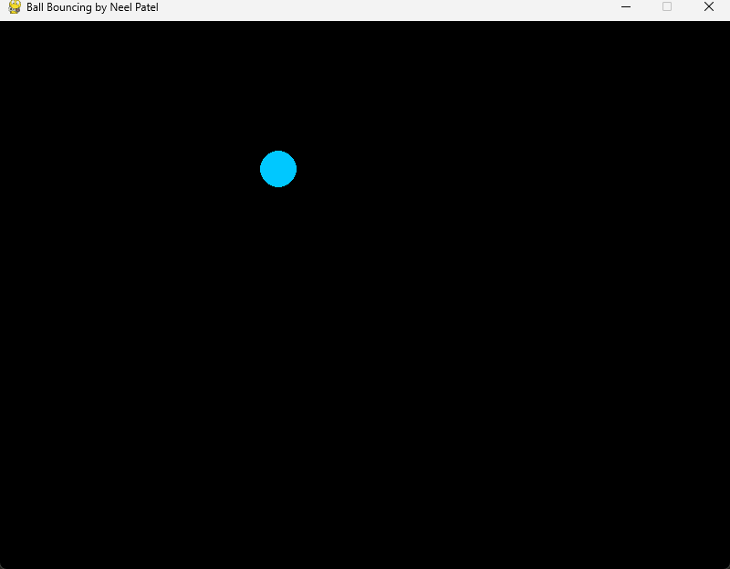
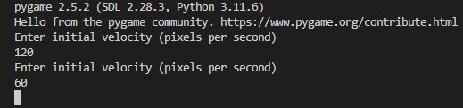

# Bouncing-Ball-Physics-Engine
User is prompted to enter an inital velocity and angle and a window will appear that will graph the trajectory of that ball if all energy and momentum is conserved.

Code uses pygame library in order to draw a ball bouncing on the screen
Upon approaching the edges of the screen, the ball will bounce off

Initial Velocity should be input as an integer in pixels per second

Angle should be input as an integer measured in degrees

Window:

Terminal:
